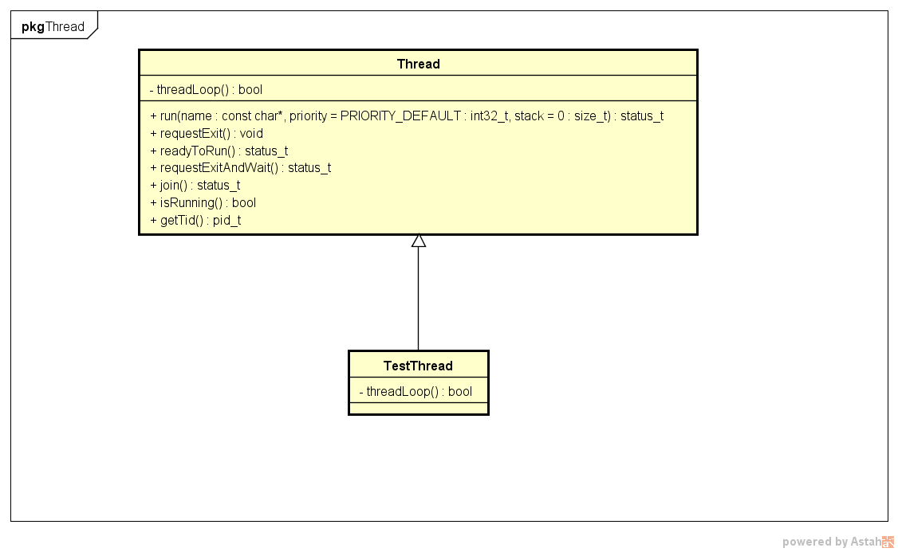
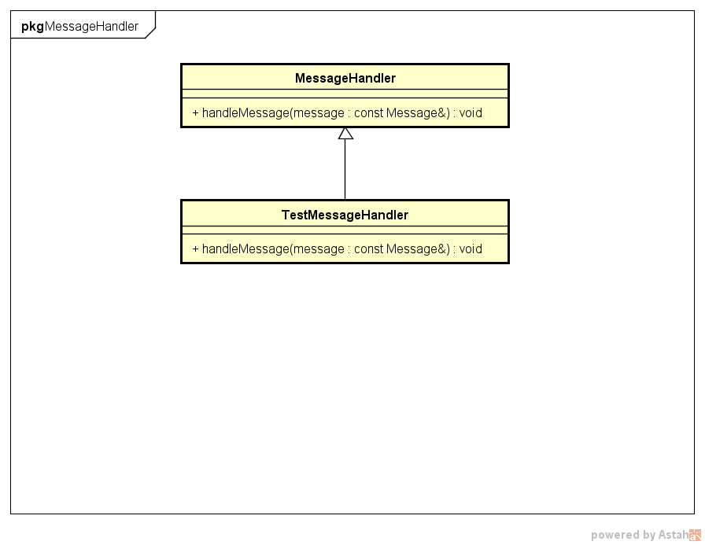

##线程和消息队列
###1. 简介
起线程是通过继承`Thread`类并且实现`threadLoop`函数实现的  
消息队列是通过使用`Looper`类实现的
###2. 类图
 
 
###3. 使用步骤
1. 继承`MessageHandler`类并实现其`handleMessage`函数  
2. 继承`Thread`类并实现其`threadLoop`函数，并且让这个类持有一个`Looper`类实例  
这个类需要提供一个`postMessage`接口，其参数`timeoutMs`默认值为0，该接口调用`Looper`的`sendMessage`或者`sendMessageDelayed`

		void TestThread::postMessage(const android::Message& message, nsecs_t timeoutMs)
		{
		    if (timeoutMs == 0) {
		        mLooper->sendMessage(new TestMessageHandler(), message);
		    }
		    else {
		        mLooper->sendMessageDelayed(milliseconds_to_nanoseconds(timeoutMs), new TestMessageHandler(), message);
		    }
		}
3. 调用`Thread`类的`start`函数将线程跑起来

		mThread->start("testlooper");
4. 需要发送消息的时候调用`TestThread`的`sendMessage`函数，则消息会无延迟地发送到传入的`TestMessageHandler`类的`handleMessage`函数中  
如果需要延迟，则可以将`postMessage`的第二个参数设为自己想要的延迟时间，单位为ms

		mThread->postMessage(message);
	    mThread->postMessage(message, 5000);
###4. 参考demo
minitcu/frameworks/base/test/TestLooper